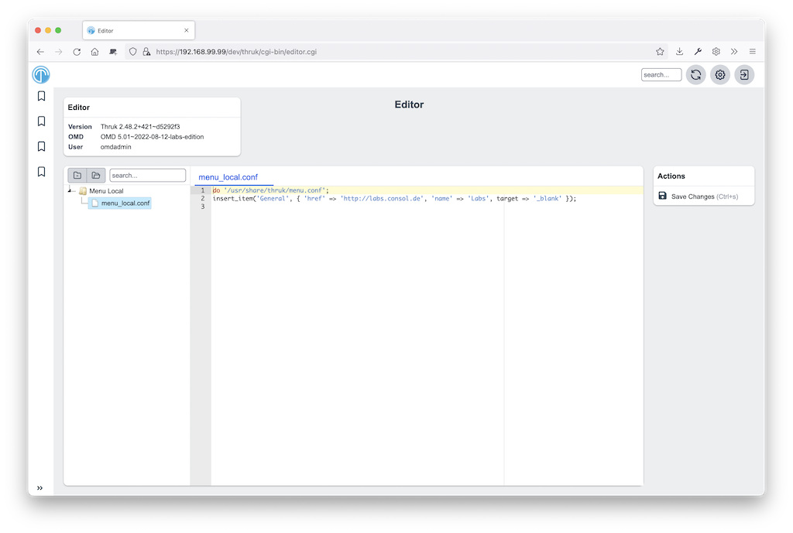

## Editor Thruk Plugin

This plugin allows you to edit text files.

## Installation

Assuming you are using OMD (omdistro.org).
All steps have to be done as site user:

    %> cd etc/thruk/plugins-enabled/
    %> git clone https://github.com/sni/thruk-plugin-editor.git editor
    %> omd reload apache

You now have a new menu item under System -> Editor.

In order to edit text files, you have to define which files to edit. Create a
new file:

`~/etc/thruk/thruk_local.d/editor.conf`.

For example:

    <editor>
      name   = Menu Local
      groups = Admins,Superadmins
      <files>
        folder = etc/thruk/
        filter = menu_local\.conf$
        syntax = perl
        action = perl_editor_menu
      </files>
    </editor>

    <action_menu_actions>
      perlsyntax   = /usr/bin/perl -Mstrict -wc
    </action_menu_actions>

You have to reload the apache to activate changes
from the `thruk_local.d` folder.

## Authorization

Authorization can be done either by using the `groups` item like in the example
above or by putting the edit sections in a Group block like:

    <Group Admins>
      <editor>
        name   = Business Process
        <files>
          folder = /etc/thruk/bp/
          filter = \.pm$
          syntax = perl
        </files>
      </editor>
    </Group>

## Syntax Highlighting

Available syntax highlighting modes are listed as mode-* files in
https://github.com/sni/thruk-plugin-editor/tree/master/root/ace-builds/src-min-noconflict

Common syntax modes are:

  - sh
  - perl
  - python
  - ini
  - nagios

## Actions

Then lets create a custom action for a syntax check. Create a new file:

`~/etc/thruk/action_menus/perl_editor_menu.json`.

With this content:

    [
      "-",
      {"icon":"fa-spell-check",
       "label":"Syntax Check",
       "action":"server://perlsyntax/$TMPFILENAME$"
      },
    ]

## Macros

The editor plugin provides two extra macros.

  - $FILENAME$ contains the path to the open file.
  - $TMPFILENAME$ contains the path to a temporary file with the unsaved
    changes. Use this macro for syntax checks or similar.
